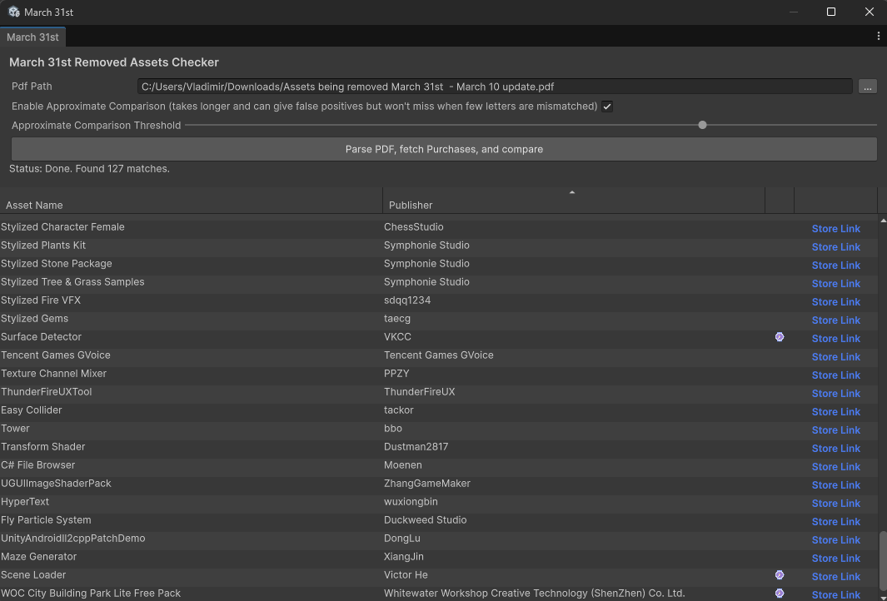

# March 31st

Unity is removing some Assets from the Asset Store, and sent us a list of them in the form of a pdf file.

See [the Unity Discussions thread](https://discussions.unity.com/t/a-notice-for-asset-store-assets-from-publishers-in-greater-china/1711108) for more details.

This tool helps you compare the aforementioned list with your purchased Assets.



## How to use

Open the Unity Package Manager, click the plus button, select `Add package from git URL...` and paste `https://github.com/vklubkov/March31st.git` (or `git@github.com:vklubkov/March31st.git` if you are using SSH)

Use `Tools -> March 31st..` and install the dependencies (Unity will throw few popups at you during this process, you have to manually get rid of them). 

Installed dependecies are:
- [NuGetForUnity](https://github.com/GlitchEnzo/NuGetForUnity)
- [Tabula](https://www.nuget.org/packages/Tabula)
- [UglyToad.PdfPig](https://www.nuget.org/packages/PdfPig/)
- [Microsoft.Bcl.HashCode](https://www.nuget.org/packages/Microsoft.Bcl.HashCode/)

*You can also install them manually using the Unity Package Manager for installing NuGetForUnity and then NuGetForUnity itself.
After that, add `MARCH31ST_TABULA_AVAILABLE` to `Player Settings -> Player -> Other Settings -> Scripting Define Symbols`.*

After the compilation is finished, you will see the window similar to the screenshot above, but with empty table.

Specify the path to the pdf file, press `Parse PDF, fetch Purchases, and compare` and wait for it to finish.

The table will contain the list of affected assets you have purchased.

Assets purchased within last 6 months will have the watch icon displayed.

## Complete uninstall

1. Remove `March31st` using Unity Package Manager.
2. Go to `Player Settings -> Player -> Other Settings -> Scripting Define Symbols` and remove `MARCH31ST_TABULA_AVAILABLE`. Don't forget to click `Apply`.
3. Go to `NuGet -> Manage NuGet Packages` and uninstall `Tabula`.
4. Remove `NuGetForUnity` using Unity Package Manager.
5. Go to `Player Settings -> Package Manager -> Scoped Registires` and remove the `package.openupm.com` registry. Or, if you are using it in your project, remove the `com.github-glitchenzo.nugetforunity` scope from it.

## AI use disclosure

I used an AI agent to generate the main window, the pdf parser and the purchases fetcher. Then, I used specialized prompts to improve the window and the fetcher. Plus some manual changes to them. Pdf parser was rewritten manually. The rest of the code is written by me.

## LICENSE

[MIT](LICENSE.md)

```
MIT License

Copyright (c) 2026 Vladimir Klubkov

Permission is hereby granted, free of charge, to any person obtaining a copy
of this software and associated documentation files (the "Software"), to deal
in the Software without restriction, including without limitation the rights
to use, copy, modify, merge, publish, distribute, sublicense, and/or sell
copies of the Software, and to permit persons to whom the Software is
furnished to do so, subject to the following conditions:

The above copyright notice and this permission notice shall be included in all
copies or substantial portions of the Software.

THE SOFTWARE IS PROVIDED "AS IS", WITHOUT WARRANTY OF ANY KIND, EXPRESS OR
IMPLIED, INCLUDING BUT NOT LIMITED TO THE WARRANTIES OF MERCHANTABILITY,
FITNESS FOR A PARTICULAR PURPOSE AND NONINFRINGEMENT. IN NO EVENT SHALL THE
AUTHORS OR COPYRIGHT HOLDERS BE LIABLE FOR ANY CLAIM, DAMAGES OR OTHER
LIABILITY, WHETHER IN AN ACTION OF CONTRACT, TORT OR OTHERWISE, ARISING FROM,
OUT OF OR IN CONNECTION WITH THE SOFTWARE OR THE USE OR OTHER DEALINGS IN THE
SOFTWARE.
```

Installed tools are not included in this repo, but I selected those that have permissive (MIT and Apache 2.0) licenses just in case.
